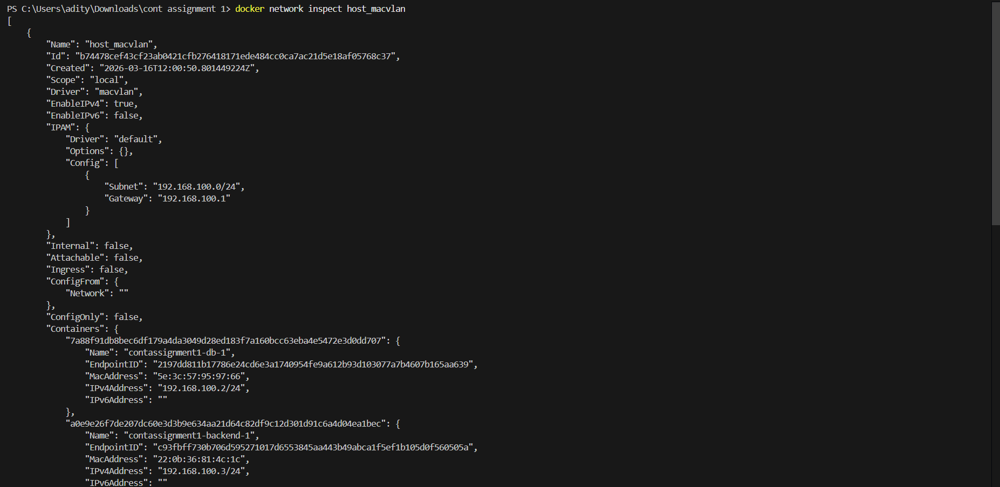
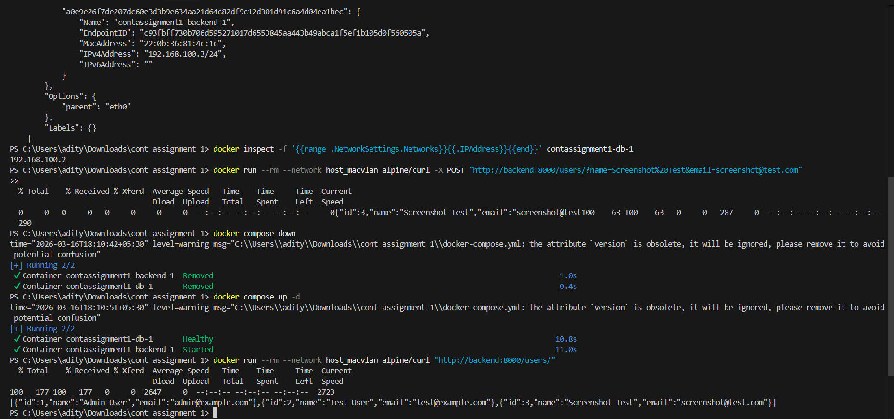

# Project Assignment Screenshots

## 1. Docker Network Inspect
Below is the screenshot showing the configuration of the `host_macvlan` network, including the assigned subnet, gateway, and the endpoints attached to it (backend and database containers).

## 2. Container IP Addresses & Volume Persistence
This screenshot proves that:
1. The database and backend containers successfully acquired IP addresses (`192.168.100.2` and `192.168.100.3`) from the Macvlan network.
2. A new user ("Screenshot Test") was added to the database via a POST request.
3. The containers were destroyed using `docker compose down` and brought back up using `docker compose up -d`.
4. A subsequent GET request proves the "Screenshot Test" user data remained intact, verifying that the PostgreSQL named volume (`pgdata`) correctly persists data across container restarts.

