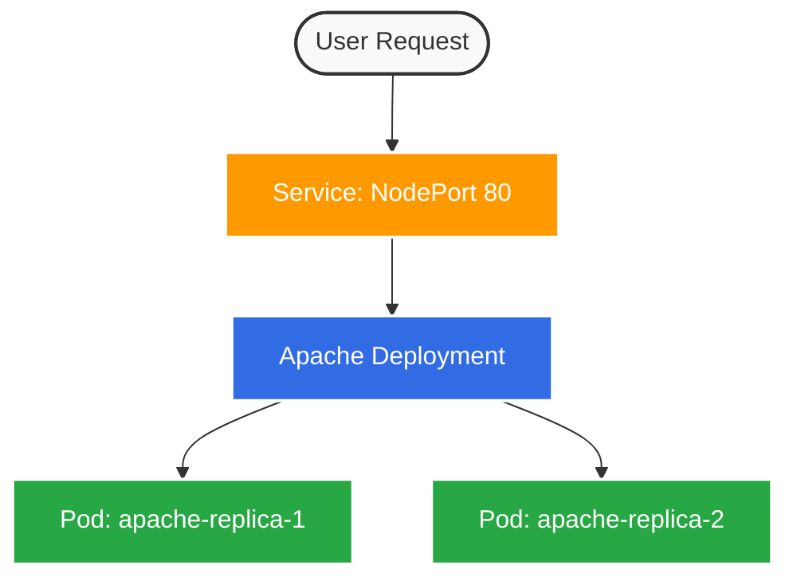

<div align="center">
  
  <br/>
  <h1>Kubernetes Apache Web App Lab</h1>
  <p><b>A visual & practical journey into Pod lifecycle, Deployments, and Self-Healing.</b></p>
  
  [](https://kubernetes.io/)
  [](https://httpd.apache.org/)


  <br/><br/>
  <h3>Submitted by:</h3>
  <p>
    <b>Apratim Saxena</b><br/>
    SAP ID: 500119616 | Enrollment No.: R2142231558<br/>
    B. Tech CSE 3rd Year (6th Semester CCVT)
  </p>
</div>

<br/>

> **Objective:** Deploy and manage a simple Apache-based web server using Kubernetes to demonstrate Pod lifecycle management, deployment scaling, runtime container modification, self-healing, and debugging failure scenarios.

---

## Architecture Overview



---

## Prerequisites (What we started with)
- [x] A running Kubernetes cluster (Actually, we had to provision one using `kind`!)
- [x] `kubectl` CLI installed and configured
- [x] Local terminal access

---

## Execution & Modifications

Here is an overview of exactly what we accomplished to complete the lab dynamically!

### Phase 0: Provisioning the Environment
The environment was missing a local cluster initially, so we spun one up instantly using `kind`:
```bash
kind create cluster
```
*Result:* A pristine, ready-to-use Kubernetes instance executing flawlessly.

### Phase 1: Basic Pod Lifecycle
We deployed a standalone Pod using the `httpd` image to test raw lifecycle behaviors:
```bash
kubectl run apache-pod --image=httpd
kubectl describe pod apache-pod
kubectl delete pod apache-pod
```
> **Observation:** Standalone Pods are ephemeral and do not recover from deletion. Once gone, they are completely removed from the cluster architecture.

### Phase 2: Deployments & High Availability
To ensure continuous availability, we wrapped our Apache container in a Deployment and exposed it via a NodePort Service:
```bash
kubectl create deployment apache --image=httpd
kubectl expose deployment apache --port=80 --type=NodePort
```
*Result:* Traffic could now dynamically route to any of our managed Pods effortlessly.

### Phase 3: Scaling the Load
We needed to simulate handling more traffic, so we scaled the Deployment parameters:
```bash
kubectl scale deployment apache --replicas=2
```
*Result:* Two independent instances of the Apache web server sprang to life to balance the simulated load.

### Phase 4: Intentional Chaos (Debugging)
To test our debugging skills, we intentionally broke the state of the Deployment:
```bash
kubectl set image deployment/apache httpd=wrongimage
# Expected error: ImagePullBackOff or ErrImagePull
```
**The Fix:**
```bash
kubectl set image deployment/apache httpd=httpd
kubectl rollout status deployment/apache
```
*Result:* Kubernetes safely isolated the bad deployment configuration, attempting to roll it out but preventing a complete application crash. Fixing the image name instantly resolved the issue.

### Phase 5: Mutating Runtime State
We verified that we could mutate a running application directly (though not recommended for long-term state):
```bash
kubectl exec -it <pod-name> -- /bin/bash
echo "Hello from Kubernetes" > /usr/local/apache2/htdocs/index.html
```
*Result:* The new page returned "Hello from Kubernetes" instead of the default Apache "It works!" template. *(Note: This is temporary—if the Pod restarts, manual edits will disappear!)*

### Phase 6: Self-Healing Magic
We tested the limits of our deployment by manually deleting a running Pod without warning:
```bash
kubectl delete pod <pod-name>
```
*Result:* The Deployment Controller immediately detected the missing pod and spun up a replica replacement in milliseconds, ensuring the desired state (`replicas=2`) was perfectly maintained.

---

## Quick Reference: The Original Lab Tasks

In case you generally want to follow along with the original step-by-step procedure, the core tasks are retained beautifully right here:

<details>
<summary><b>Click to expand the original lab steps!</b></summary>
<br/>

**Step 1 — Run Apache Pod**  
```bash
kubectl run apache-pod --image=httpd
kubectl get pods
kubectl describe pod apache-pod
```

**Step 2 — Verify Application**  
```bash
kubectl port-forward pod/apache-pod 8081:80
```

**Step 3 — Delete Pod**  
```bash
kubectl delete pod apache-pod
```

**Step 4 — Create Deployment**  
```bash
kubectl create deployment apache --image=httpd
kubectl get deployments
kubectl get pods
```

**Step 5 — Expose Deployment**  
```bash
kubectl expose deployment apache --port=80 --type=NodePort
kubectl port-forward service/apache 8082:80
```

**Step 6 — Scale Deployment**  
```bash
kubectl scale deployment apache --replicas=2
kubectl get pods
```

**Step 7 — Modify Application**  
```bash
kubectl exec -it <pod-name> -- /bin/bash
echo "Hello from Kubernetes" > /usr/local/apache2/htdocs/index.html
exit
```

**Step 8 — Debugging Scenario**  
```bash
kubectl set image deployment/apache httpd=wrongimage
kubectl get pods
```

**Step 9 — Fix Deployment**  
```bash
kubectl set image deployment/apache httpd=httpd
```

**Step 10 — Self Healing**  
```bash
kubectl delete pod <pod-name>
kubectl get pods -w
```
</details>

---

## Core Takeaways

| Concept | Behavior in Kubernetes |
| :--- | :--- |
| **Standalone Pods** | Purely ephemeral. Do not self-recover from local deletions or node failures. |
| **Deployments** | Robust lifecycle management, offering scaling, rolling updates, and complete self-healing guarantees. |
| **Terminal/Exec Changes** | Temporary edits. Good for testing, but state is completely lost upon container termination. |
| **Misconfigurations** | Kubernetes gracefully isolates failures (e.g., bad images), maintaining the availability of previous replicas. |

<br/>
